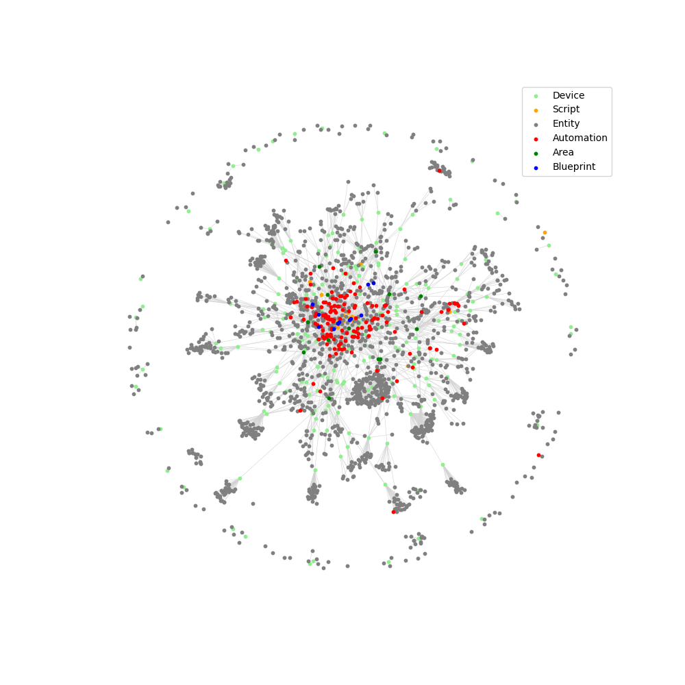

# An Eloquent Home
[Design Principles](#design-principles) | [Hub](#hub) | [Entities](#entities) | [Core Integrations](#core-integrations) | [Extensions](#extensions) | [Dashboards](#dashboards)

Hello!  This repo contains the configuration for our [Home Assistant](https://www.home-assistant.io/) setup.  What started as a curiosity to while away the time during Covid lockdowns in 2020 is now the primary way in which we interact with and control our home.

## Design Principles
The following graphic visualises all the components in our setup as a network, with components connected to each other if one references another (eg. if an `entity` belongs to a `device` or an `automation` calls a `script`).

The network topology demonstrates some principles we employ in setting up our system:
1. An __automation first__ approach puts automations, scripts and blueprints at the core: Things should just adjust themselves in response to changes in the environment, without needing user intervention
2. The high degree of clustering in the core is driven by __maximum modularity__: Devices, user interfaces and even the automation logic are deployed as repeatable modules, allowing great flexibility in combining them to produce new functionalities, while minimising the number of distinct components that need to be maintained.
3. Many entities are also linked to multiple automations, providing __maximum redundancy__: Aside from automated control, devices can be controlled by app, ZigBee remote controls or voice assistant.  The only things built into our walls are data and power cables.  All smart devices can be moved or removed easily.  All devices can function locally regardless of cloud connectivity.  A non-smart fallback option is always available.
4. Each small part contributes to a larger pattern, enabling __emergent helpfulness__: The system responds robustly to changes in the real-world context.  The UI allows users to interpret the state of the whole system at a glance, including relationships between different devices.

## Hub
* Refurbished [Lenovo Thinkcentre M93p Tiny](https://psref.lenovo.com/syspool/Sys/PDF/ThinkCentre/ThinkCentre_M93_M93p_Tiny/ThinkCentre_M93_M93p_Tiny_Spec.PDF)
* [Home Assistant Operating System](https://www.home-assistant.io/installation/alternative) [16.3](https://github.com/home-assistant/operating-system/releases/tag/16.3) running in a [Proxmox VM](https://www.proxmox.com/)
* [Home Assistant Core 2025.11.3](https://github.com/home-assistant/core/releases/tag/2025.11.3)
* 4 cores, 6GB RAM, 32GB storage

## Entities

Domain | Quantity
-- | --
[`assist_satellite`](https://www.home-assistant.io/components/assist_satellite) | 2
[`automation`](https://www.home-assistant.io/components/automation) | 136
[`binary_sensor`](https://www.home-assistant.io/components/binary_sensor) | 171
[`button`](https://www.home-assistant.io/components/button) | 179
[`calendar`](https://www.home-assistant.io/components/calendar) | 7
[`camera`](https://www.home-assistant.io/components/camera) | 7
[`climate`](https://www.home-assistant.io/components/climate) | 6
[`conversation`](https://www.home-assistant.io/components/conversation) | 1
[`cover`](https://www.home-assistant.io/components/cover) | 15
[`device_tracker`](https://www.home-assistant.io/components/device_tracker) | 2
[`event`](https://www.home-assistant.io/components/event) | 1
[`fan`](https://www.home-assistant.io/components/fan) | 6
[`image`](https://www.home-assistant.io/components/image) | 4
[`input_boolean`](https://www.home-assistant.io/components/input_boolean) | 15
[`input_datetime`](https://www.home-assistant.io/components/input_datetime) | 17
[`input_number`](https://www.home-assistant.io/components/input_number) | 24
[`input_select`](https://www.home-assistant.io/components/input_select) | 9
[`input_text`](https://www.home-assistant.io/components/input_text) | 19
[`light`](https://www.home-assistant.io/components/light) | 73
[`media_player`](https://www.home-assistant.io/components/media_player) | 4
[`notify`](https://www.home-assistant.io/components/notify) | 2
[`number`](https://www.home-assistant.io/components/number) | 143
[`person`](https://www.home-assistant.io/components/person) | 3
[`remote`](https://www.home-assistant.io/components/remote) | 4
[`script`](https://www.home-assistant.io/components/script) | 13
[`select`](https://www.home-assistant.io/components/select) | 59
[`sensor`](https://www.home-assistant.io/components/sensor) | 673
[`stt`](https://www.home-assistant.io/components/stt) | 1
[`sun`](https://www.home-assistant.io/components/sun) | 1
[`switch`](https://www.home-assistant.io/components/switch) | 72
[`text`](https://www.home-assistant.io/components/text) | 32
[`tts`](https://www.home-assistant.io/components/tts) | 2
[`update`](https://www.home-assistant.io/components/update) | 115
[`vacuum`](https://www.home-assistant.io/components/vacuum) | 1
[`wake_word`](https://www.home-assistant.io/components/wake_word) | 1
[`weather`](https://www.home-assistant.io/components/weather) | 1
[`zone`](https://www.home-assistant.io/components/zone) | 16
Total | 1837

## Core Integrations
- [AdGuard](https://home-assistant.io/integrations/adguard)
- [Broadlink](https://home-assistant.io/integrations/broadlink)
- [Conversation](https://home-assistant.io/integrations/conversation)
- [Downloader](https://home-assistant.io/integrations/downloader)
- [ESPHome](https://home-assistant.io/integrations/esphome)
- [Folder Sensor](https://home-assistant.io/integrations/folder)
- [Fully Kiosk](https://home-assistant.io/integrations/fully_kiosk)
- [Generic Camera](https://home-assistant.io/integrations/generic)
- [Generic Thermostat](https://home-assistant.io/integrations/generic_thermostat)
- [Google Assistant](https://home-assistant.io/integrations/google_assistant)
- [Google Cast](https://home-assistant.io/integrations/cast)
- [Home Assistant Companion](https://home-assistant.io/integrations/mobile_app)
- [Local Calendar](https://home-assistant.io/integrations/local_calendar)
- [Local File Camera](https://home-assistant.io/integrations/local_file)
- [MQTT](https://home-assistant.io/integrations/mqtt)
- [RESTful](https://home-assistant.io/integrations/rest)
- [RESTful Command](https://home-assistant.io/integrations/rest_command)
- [RESTful Sensor](https://home-assistant.io/integrations/sensor.rest)
- [Shell Command](https://home-assistant.io/integrations/shell_command)
- [Statistics Sensor](https://home-assistant.io/integrations/statistics)
- [Switchbot Bluetooth](https://home-assistant.io/integrations/switchbot)
- [System Monitor](https://home-assistant.io/integrations/systemmonitor)
- [Template Binary Sensors, Sensors & Images](https://home-assistant.io/integrations/template)
- [Template Cover](https://home-assistant.io/integrations/cover.template)
- [Template Fan](https://home-assistant.io/integrations/fan.template)
- [Template Switch](https://home-assistant.io/integrations/switch.template)
- [Template Weather](https://home-assistant.io/integrations/weather.template)
- [Time & Date](https://home-assistant.io/integrations/time_date)
- [ZigBee Home Automation](https://home-assistant.io/integrations/zha)
## Extensions

### Add-ons
- ESPHome Device Builder
- File editor
- Mosquitto broker
- openWakeWord
- Piper
- Samba share
- Whisper

### Custom integrations
- [Generate Readme](https://github.com/custom-components/readme)
- [HACS](https://github.com/hacs/integration)
- [Local Tuya](https://github.com/rospogrigio/localtuya)
- [Mqtt Vacuum Camera](https://github.com/sca075/mqtt_vacuum_camera)
- [Proxmox Ve](https://github.com/dougiteixeira/proxmoxve)
- [Pyscript](https://github.com/custom-components/pyscript)
- [Smartthinq Lge Sensors](https://github.com/ollo69/ha-smartthinq-sensors)
- [SSH](https://github.com/zhbjsh/homeassistant-ssh)
- [Watchman](https://github.com/dummylabs/thewatchman)

### Custom dashboard cards
- [Apexcharts Card](https://github.com/RomRider/apexcharts-card)
- [Button Card](https://github.com/custom-cards/button-card)
- [Decluttering Card](https://github.com/custom-cards/decluttering-card)
- [Slider Button Card](https://github.com/custom-cards/slider-button-card)
- [State Switch](https://github.com/thomasloven/lovelace-state-switch)
- [Xiaomi Vacuum Map Card](https://github.com/PiotrMachowski/lovelace-xiaomi-vacuum-map-card)

## Dashboards
In addition to providing direct control and visual feedback on the state of each controllable device in our house, our dashboards are also designed to be _infographics_ that provide insights into the usage trends of multiple devices of the same type, across different rooms and throughout the whole house.  They are maps in the spirit of the Tube maps - providing a stripped-down view of the components with just enough information to appreciate how the parts relate to the whole.  And the entire graphic fits on one screen on a mobile device, so all information is available at a glance.  The design principles are:
1. __Only useful information, no more and no less__: Only the most pertinent information about the state of each device is provided.  If it is off, only the option to turn it on is available.  Options to set levels (brightness, temperature, speed etc.) and special controls (automated control, timers, modes etc.) are made available only when the device is on.
2. __Consistency and interpretability__: Devices are grouped together in 2-dimensional grids by type and location to facilitate identification and interpretation.  Symbology (icons, representation of current state) is uniform across all devices of the same type.  Interactions with the controls are standardised: one tap to turn on, drag to adjust, two taps or drag to bottom to turn off, hold for more information and options.
3. __Intuitiveness and playfulness__: The order of rooms in the grids roughly corresponds to the real arrangement of the rooms in space, facilitating the identification of trends across space and time.  With minimal text and the evocative use of multi-dimensional symbology (icon, colour, proportional fill, border etc.), the user is invited to interact with the controls to discover and learn how the controls adapt to different circumstances, in the spirit of experimentation and puzzle-solving.

From left to right:
- __Main Dashboard__: Devices are generally grouped by room (rows) and type (columns).  A device that is off is represented by a simple button.  Tapping the button turns on the device and reveals a slider to adjust the device's setting (brightness, speed, temperature etc.).  Tapping the icon in the slider activates additional options (eg. reversing direction for fans, turning on auto control for ACs).  Holding brings up more information.  Tapping on the room icons sets the recommended scene in the room across all devices.  Double-tapping on the room icons turns off all devices in the room.
- __Sensors Dashboard__: Sensors are grouped by room (rows) and type (columns).  Sensor states are reflected by colour codes, allowing the data in the grid to be interpreted spatially like a chloropleth map.  Key details are summarised by numerical labels.
- __Zigbee Dashboard__: With more than 100 Zigbee devices in our network, the default ZHA network map is unreadable.  This grid provides information on the Link Quality Index (LQI) for each Zigbee device, with green indicating a high LQI and red a low LQI.  Devices are grouped into rooms (columns) and arranged with routers first (devices with grey outlines), followed by battery-powered blinds, remote controls and sensors.  The Zigbee coordinator is in the living room, so LQIs in the living room and immediately adjacent rooms tend to be higher, while LQIs in rooms towards the edges of the house tend to be lower due to interference.  This view allows for quick identification of which devices have fallen off the network and may need to be repaired.

***

This readme file was _also_ auto-generated by Home Assistant via [this custom integration](https://github.com/custom-components/readme)